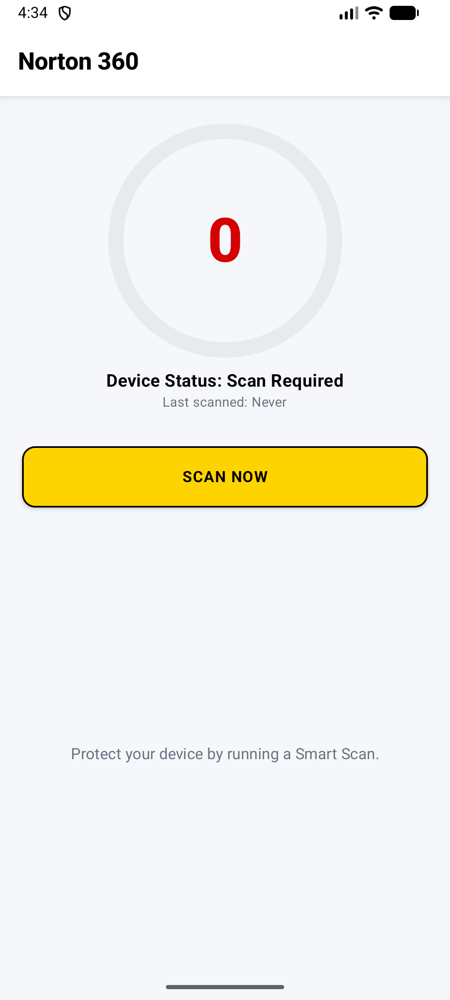
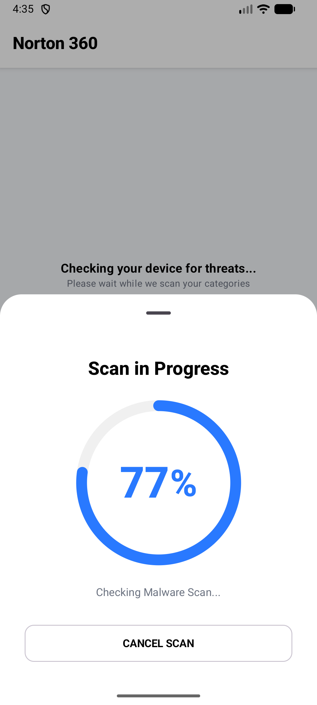
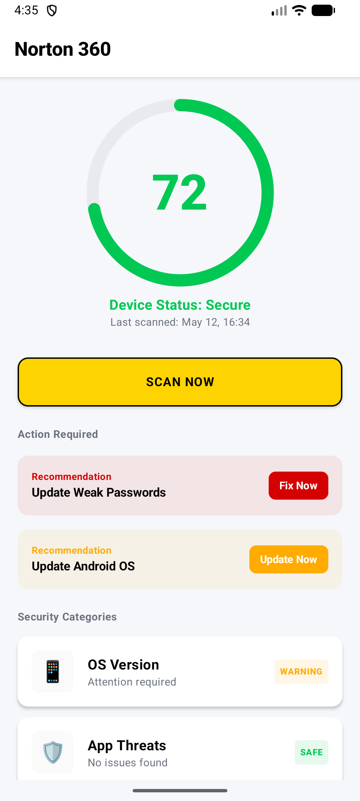

# Security Health Dashboard (Norton AI-First Assignment)

## Project Overview  
I chose **Option A: Security Health Dashboard**. This app simulates a Norton 360 style device security experience by displaying an overall security score, category based security checks, and a simulated scan flow with animated progress and scan results.

The app is built using Kotlin and Jetpack Compose following an MVVM architecture. It demonstrates AI-assisted development workflows, structured domain/data separation, and production state management with StateFlow.

The scan process is fully simulated and designed to mimic real security checks such as OS version validation, app threat scanning, Wi-Fi safety, password strength evaluation, and VPN status checks.

## Scoring Logic

Each security category has an individual score from 0–100. The overall security score is calculated as a simple average of all category scores and mapped to:

- 0–39: At Risk
- 40–69: Needs Attention
- 70–89: Secure
- 90–100: Excellent

## Setup Instructions  
- Clone this repository.  
- Open the project in Android Studio (Koala or later).  
- Ensure Kotlin and Gradle are properly synced.  
- Run the app on an Android device or emulator (API 26+).  
- To run tests, open terminal and run:  
  `./gradlew test`

## Screenshots

  
  
  

## AI Interaction Log  

### 1. Prompt  
"Design a production style Android Security Health Dashboard inspired by Norton 360 using Jetpack Compose and Material 3. The screen should include a circular security score indicator, modular security categories with independent status states and a Scan Now action that triggers a simulated real-time scan flow. Follow MVVM architecture and keep composables stateless where possible"

**Commentary:**  
I used this prompt to establish the initial architecture and UI direction instead of generating isolated UI components. The AI produced the foundational Compose structure, which I then refined to improve state hoisting, composable reusability, and alignment with clean architecture principles.

### 2. Prompt  
"Refactor the DashboardViewModel to use StateFlow and coroutine based scan state management with deterministic UI updates. Simulate progressive scan updates per category while ensuring thread safe state handling, cancellation support, and proper separation between UI state and domain logic"

**Commentary:**  
This prompt focused on production-grade state management rather than simple loading logic. The generated implementation helped structure the scan lifecycle, while I manually refined coroutine handling, cancellation behavior, and stable state transitions between Idle, Scanning, and Completed states.

### 3. Prompt  
"Generate realistic DTOs, domain models, and mapper structures for a cybersecurity dashboard application. The models should resemble a real backend API contract with timestamps, category metadata, recommendations, and security scoring while maintaining proper separation between API and UI layers"

**Commentary:**  
Instead of requesting simple mock objects, I explicitly asked for layered model architecture. The AI generated the initial DTO/domain structure, which I refined to improve naming consistency, extensibility, and mapper organization for a more realistic production architecture.

### 4. Prompt  
"Write robust coroutine based unit tests for DashboardViewModel using StandardTestDispatcher and kotlinx-coroutines-test. Cover scan initialization, progress updates, cancellation behavior, and completed scan states. Ensure deterministic execution using advanceUntilIdle and avoid flaky asynchronous assertions"

**Commentary:**  
The goal here was not only test generation but also testing strategy validation. I used the AI to scaffold coroutine tests, then manually corrected dispatcher timing issues and improved assertions to ensure reliable and deterministic ViewModel testing behavior.

### 5. Prompt  
"Perform a senior level architectural review of my Android Jetpack Compose project. Analyze thread safety, coroutine usage, dependency injection readiness, localization strategy, error handling, state management, testability, and UI performance. Suggest production grade improvements"

**Commentary:**  
This prompt was intentionally broad and architecture focused to simulate a real engineering review process. The feedback helped identify weaknesses in thread safety, error handling, and dependency management, which I later addressed by improving dispatcher handling, introducing Hilt based dependency injection, expanding test coverage, and moving hardcoded UI strings into localized resources.

## AI Code Review Summary  
I used AI-assisted code review to improve production readiness. Based on feedback, I implemented:

- **Thread Safety:** Ensured all UI state updates happen on `Dispatchers.Main.immediate` to avoid race conditions.  
- **Localization:** Moved all user-facing strings to `strings.xml` for proper internationalization.  
- **Dependency Injection:** Implemented Hilt with `@HiltViewModel`, `@HiltAndroidApp`, `AppModule`, and injected ViewModel dependencies.
- **Error Handling:** Added try-catch blocks in repository and use cases with UI error state handling to prevent crashes and stuck states.  
- **Test Improvements:** Extended test coverage to include cancellation, error states, and edge cases in scan flow logic.  
- **UI Stability:** Fixed scan layout jumps by standardizing container sizing for score components.  

## Norton 360 Observations
After exploring Norton 360: Security & VPN, I noticed:

- The dashboard prioritizes a large security score indicator as the main focus of the screen
- Security categories are grouped into compact status cards with clear visual hierarchy
- The app uses color-coded states (green/yellow/red) to communicate device safety instantly
- Smart Scan provides step-by-step progress feedback instead of showing only a loading spinner
- The UI feels lightweight and responsive with smooth transitions between scan states
- Norton heavily emphasizes reassurance through concise security explanations and actionable recommendations

What I would improve in Norton 360:

- Add more transparency about how the security score is calculated
- Reduce layout shifts during scan transitions to improve visual stability
- Add optional advanced scan details for technical users
- Improve offline support for previously scanned device status

## Reflection  

### What I learned:
- AI is most effective when used for architecture suggestions, not just code generation. Proper prompt structuring leads to significantly better design output.  
- Coroutine state management and thread safety are critical in modern Android apps using StateFlow.  
- Real-world apps require strong separation between UI state, domain logic, and data models.  

### What I would do differently:
- I would introduce Hilt earlier in the project before implementing ViewModel logic.  
- I would design the domain layer first before building UI components.  
- I would add more failure-mode testing earlier in development instead of after core implementation.  

## Demo Video  
[Demo Link](https://youtu.be/UECGbYYbUVs)
